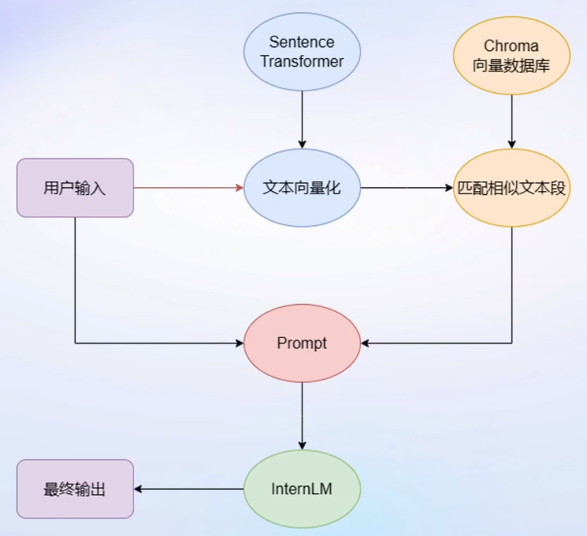
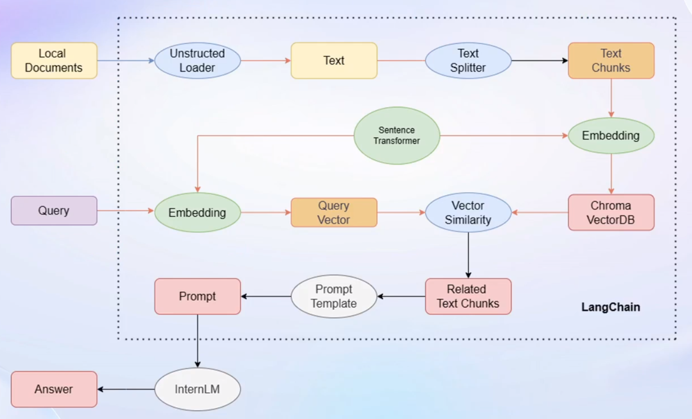

# 基于InternLM和LangChain搭建知识库

## 1. 大模型开发范式

#### 1.1 LLM的局限性

- 知识时效性受限：如何让LLM获取最新的知识

- 专业能力有限：如何打造垂直域大模型

- 定制成本高：如何打造个人专属的LLM应用

#### 1.2 解决方法：RAG vs FineTune

**RAG - 检索增强生成**

    ⼤模型外挂知识库。对用户的提问，先从知识库中获取匹配的文档，然后把用户的问题和匹配的文档一起交给大模型来生成回答，从而提高大模型的知识储备。

**FineTune - 微调**

    在一个新的较小的训练集上进行轻量级的训练微调，从而提升大模型在这个新数据集上的能力。

**特点**

| RAG      | FineTune |
|:-------- |:-------- |
| 成本低      | 可个性微调    |
| 可实时更新    | 知识覆盖面广   |
| 受基座模型影响⼤ | 成本高昂     |
| 单次回答知识有限 | 无法实时更新   |

#### 1.3 RAG：检索增强生成



## 2. LangChain简介

    LangChain框架是一个开源工具，通过为各种LLM提供通用接口来醓应用程序的开发流程，帮助开发者自由构建LLM应用。

    它的核心模块是链（Chains），将组件组合实现端到端应用，通过一个对象封装实现一系列LLM操作。例如检索问答链，覆盖实现了RAG的全部流程。

#### 2.1 基于LangChain搭建RAG应用



## 3. 构建向量数据库

#### 3.1 加载源文件

    确定源文件类型，针对不同类型源文件选用不同的加载器，将带格式文本转化为无格式字符串。

#### 3.2 文档分块

    单个文档往往超过模型上下文上限，需要切分加载的文档。

- 一般按字符串长度进行分割
- 可手动控制分割块的长度和重叠区间长度

#### 3.3 文档向量化

    使用向量数据库来支持语义检索，需要向量化文档并存入向量数据库

- 可使用任意一种Embedding模型来进行向量化
- 可使用多种支持语义检索的向量数据库，一般使用轻量级的Chroma

## 4. 搭建知识库助手

#### 4.1 将InternLM接入LangChain

    LangChain支持自定义LLM。把InternLM部署在本地，封装一个自定义LLM类，调用本地InternLM即可。

#### 4.2 构建检索问答链

    LangChain提供了检索问答链模板，可以自动实现知识检索、Prompt嵌入、LLM问答的全部流程。将基于InternLM的自定义LLM和已构建的向量数据库接入到检索问答链的上游。调用检索问答链，即可实现知识库助手的核心功能。

#### 4.3 RAG方案优化建议

- RAG问答系统性能受限于：
  
  - 检索精度
  
  - Prompt性能

- 可能的优化点
  
  - 检索方面：
    
    - 基于语义进行分割，保证每一个chunk的语义完整
    
    - 给每一个chunk生成概括性索引，检索时匹配索引
  
  - Prompt方面：
    
    - 迭代优化Prompt策略

## 5. 实际搭建过程

#### 5.1 环境配置

##### 5.1.1 InternLM模型部署

     在 [InternStudio](https://studio.intern-ai.org.cn/) 平台中创建开发机，选择 A100(1/4) 的配置，镜像选择Cuda11.7-conda，启动后根据页面说明在本地终端通过SSH连接到开发机。依次执行以下命令：

```bash
# 执行bash进入conda环境
bash
# 从本地克隆一个已有的 pytorch 2.0.1 的环境
/root/share/install_conda_env_internlm_base.sh langchain-demo
# 激活环境
conda activate langchain-demo
# 升级pip
python -m pip install --upgrade pip
# 安装运行 demo 所需要的依赖
pip install modelscope==1.9.5
pip install transformers==4.35.2
pip install streamlit==1.24.0
pip install sentencepiece==0.1.99
pip install accelerate==0.24.1
```

##### 5.1.2 模型下载

    [InternStudio](https://studio.intern-ai.org.cn/) 平台的share目录下已经准备了全系列的InternLM模型，直接用下面命令复制即可。

```
mkdir -p /root/model/ailab
cp -r /root/share/temp/model_repos/internlm-chat-7b /root/model/ailab
```

##### 5.1.3 LangChain相关环境配置

    安装依赖

```bash
pip install langchain==0.0.292
pip install gradio==4.4.0
pip install chromadb==0.4.15
pip install sentence-transformers==2.2.2
pip install unstructured==0.10.30
pip install markdown==3.3.7
```

    需要用到开源词向量模型[Sentence Transformer](https://huggingface.co/sentence-transformers/paraphrase-multilingual-MiniLM-L12-v2):（该模型相对轻量、支持中文且效果较好，也可选用其它开源词向量模型来进行 Embedding）。

```bash
pip install -U huggingface_hub
# 设置Hugging Face镜像
export HF_ENDPOINT='https://hf-mirror.com'
# 下载到
huggingface-cli download --resume-download sentence-transformers/paraphrase-multilingual-MiniLM-L12-v2 --local-dir /root/model/ailab/sentence-transformer
```

##### 5.1.4 下载NLTK相关资源

    在使用开源词向量模型构建开源词向量的时候，需要用到第三方库NLTK的一些资源。资源不存在时它会自动从网上下载，为加快速度，这里从镜像仓库手动下载相关资源。cd .. && mkdir taggers && cd taggers

```bash
cd /root && mkdir nltk_data && cd nltk_data
mkdir tokenizers && cd tokenizers
wget https://hub.fgit.cf/nltk/nltk_data/raw/gh-pages/packages/tokenizers/punkt.zip
unzip punkt.zip

cd .. && mkdir taggers && cd taggers
wget https://hub.fgit.cf/nltk/nltk_data/raw/gh-pages/packages/taggers/averaged_perceptron_tagger.zip
unzip averaged_perceptron_tagger.zip 
```

##### 5.1.5 下载本项目代码

```bash
cd /root/code
git clone https://hub.fgit.cf/InternLM/tutorial
```

#### 5.2 知识库搭建

##### 5.2.1 数据收集

    选择由上海人工智能实验室开源的一系列大模型工具开源仓库作为语料库来源，包括：

- [OpenCompass](https://gitee.com/open-compass/opencompass)：面向大模型评测的一站式平台
- [IMDeploy](https://gitee.com/InternLM/lmdeploy)：涵盖了 LLM 任务的全套轻量化、部署和服务解决方案的高效推理工具箱
- [XTuner](https://gitee.com/InternLM/xtuner)：轻量级微调大语言模型的工具库
- [InternLM-XComposer](https://gitee.com/InternLM/InternLM-XComposer)：浦语·灵笔，基于书生·浦语大语言模型研发的视觉-语言大模型
- [Lagent](https://gitee.com/InternLM/lagent)：一个轻量级、开源的基于大语言模型的智能体（agent）框架
- [InternLM](https://gitee.com/InternLM/InternLM)：一个开源的轻量级训练框架，旨在支持大模型训练而无需大量的依赖

    将上面远程开源仓库下载到本地：

```bash
cd /root/code
git clone https://gitee.com/open-compass/opencompass.git
git clone https://gitee.com/InternLM/lmdeploy.git
git clone https://gitee.com/InternLM/xtuner.git
git clone https://gitee.com/InternLM/InternLM-XComposer.git
git clone https://gitee.com/InternLM/lagent.git
git clone https://gitee.com/InternLM/InternLM.git
```

##### 5.2.3 构建知识库

    在/root/code下创建internlm_langchain目录，进入该目录并创建文件create_db.py，其内容如下：

```python
# 首先导入所需第三方库
from langchain.document_loaders import UnstructuredFileLoader
from langchain.document_loaders import UnstructuredMarkdownLoader
from langchain.text_splitter import RecursiveCharacterTextSplitter
from langchain.vectorstores import Chroma
from langchain.embeddings.huggingface import HuggingFaceEmbeddings
from tqdm import tqdm
import os

'''
为语料处理方便，将选用上述仓库中所有的md和txt文件作为示例语料库。也可以选用其中的代码文件加入到知识库中，
但需要针对代码文件格式进行额外处理（因为代码文件对逻辑联系要求较高，且规范性较强，在分割时最好基于代码模块
进行分割再加入向量数据库）。
'''
# 获取文件路径函数
def get_files(dir_path):
    # args：dir_path，目标文件夹路径
    file_list = []
    for filepath, dirnames, filenames in os.walk(dir_path):
        # os.walk 函数将递归遍历指定文件夹
        for filename in filenames:
            # 通过后缀名判断文件类型是否满足要求
            if filename.endswith(".md"):
                # 如果满足要求，将其绝对路径加入到结果列表
                file_list.append(os.path.join(filepath, filename))
            elif filename.endswith(".txt"):
                file_list.append(os.path.join(filepath, filename))
    return file_list

'''
得到所有目标文件路径之后，使用LangChain提供的FileLoader对象来加载目标文件，得到由目标文件解析出的纯文本内容。
由于不同类型的文件需要对应不同的FileLoader，我们判断目标文件类型，并针对性调用对应类型的FileLoader，同时，调用
FileLoader对象的load方法来得到加载之后的纯文本对象。
'''
# 加载文件函数，得到纯文本对象的列表
def get_text(dir_path):
    # args：dir_path，目标文件夹路径
    # 首先调用上文定义的函数得到目标文件路径列表
    file_lst = get_files(dir_path)
    # docs 存放加载之后的纯文本对象
    docs = []
    # 遍历所有目标文件
    for one_file in tqdm(file_lst):
        file_type = one_file.split('.')[-1]
        if file_type == 'md':
            loader = UnstructuredMarkdownLoader(one_file)
        elif file_type == 'txt':
            loader = UnstructuredFileLoader(one_file)
        else:
            # 如果是不符合条件的文件，直接跳过
            continue
        docs.extend(loader.load())
    return docs

# 目标文件夹
target_dir = [
    "/root/code/InternLM",
    "/root/code/InternLM-XComposer",
    "/root/code/lagent",
    "/root/code/lmdeploy",
    "/root/code/opencompass",
    "/root/code/xtuner"
]

# 加载目标文件
docs = []
for dir_path in target_dir:
    docs.extend(get_text(dir_path))

'''
得到纯文本对象列表之后，将它引入到LangChain框架中构建向量数据库。由纯文本对象构建向量数据库，我们需要先对文本进行分块，
接着对文本块进行向量化。

LangChain提供了多种文本分块工具，此处我们使用字符串递归分割器，并选择分块大小为500，块重叠长度为150。
LangChain文本分块可以参考教程《LangChain - Chat With Your Data》，链接在代码下方。
'''
# 对文本进行分块
text_splitter = RecursiveCharacterTextSplitter(
    chunk_size=500, chunk_overlap=150)
split_docs = text_splitter.split_documents(docs)

'''
用开源词向量模型Sentence Transformer来进行文本向量化。LangChain提供了直接引入HuggingFace开源社区中的模型进行
向量化的接口
'''
# 加载开源词向量模型
embeddings = HuggingFaceEmbeddings(model_name="/root/model/ailab/sentence-transformer")

'''
Chroma是目前最常用的入门数据库，选择Chroma作为向量数据库，基于上文分块后的文档以及加载的开源向量化模型，
将语料加载到指定路径下的向量数据库
'''
# 构建向量数据库
# 定义持久化路径
persist_directory = 'data_base/vector_db/chroma'
# 加载数据库
vectordb = Chroma.from_documents(
    documents=split_docs,
    embedding=embeddings,
    persist_directory=persist_directory  # 允许我们将persist_directory目录保存到磁盘上
)
# 将加载的向量数据库持久化到磁盘上
vectordb.persist()
```

    LangChain使用说明可参考吴恩达[《LangChain - Chat With Your Data》](https://github.com/datawhalechina/prompt-engineering-for-developers/tree/main/content/LangChain%20Chat%20with%20Your%20Data)课程中文版。

    运行上述脚本，即可在本地构建已持久化的向量数据库，后续直接导入该数据库即可，无需重复构建。

#### 5.3 InternLM接入LangChain

    在/root/code/internlm_langchain下创建LLM.py，内容如下：

```py
from langchain.llms.base import LLM
from typing import Any, List, Optional
from langchain.callbacks.manager import CallbackManagerForLLMRun
from transformers import AutoTokenizer, AutoModelForCausalLM
import torch

'''
为便捷构建LLM应用，我们需要基于本地部署的InternLM，继承LangChain的LLM类自定义一个InternLM LLM子类，
从而实现将InternLM 接入到LangChain框架中。完成LangChain的自定义LLM子类之后，可以以完全一致的方式调用
LangChain 的接口，而无需考虑底层模型调用的不一致。

基于本地部署的InternLM自定义LLM类并不复杂，只需从LangChain.llms.base.LLM类继承一个子类，并重写构造
函数与_call函数即可。
'''
class InternLM_LLM(LLM):
    # 基于本地 InternLM 自定义 LLM 类
    tokenizer : AutoTokenizer = None
    model: AutoModelForCausalLM = None

    def __init__(self, model_path :str):
        # model_path: InternLM 模型路径
        # 从本地初始化模型
        super().__init__()
        print("正在从本地加载模型...")
        self.tokenizer = AutoTokenizer.from_pretrained(model_path, trust_remote_code=True)
        self.model = AutoModelForCausalLM.from_pretrained(model_path, trust_remote_code=True).to(torch.bfloat16).cuda()
        self.model = self.model.eval()
        print("完成本地模型的加载")

    def _call(self, prompt : str, stop: Optional[List[str]] = None,
                run_manager: Optional[CallbackManagerForLLMRun] = None,
                **kwargs: Any):
        # 重写调用函数
        system_prompt = """You are an AI assistant whose name is InternLM (书生·浦语).
        - InternLM (书生·浦语) is a conversational language model that is developed by Shanghai AI Laboratory (上海人工智能实验室). It is designed to be helpful, honest, and harmless.
        - InternLM (书生·浦语) can understand and communicate fluently in the language chosen by the user such as English and 中文.
        """

        messages = [(system_prompt, '')]
        response, history = self.model.chat(self.tokenizer, prompt , history=messages)
        return response

    @property
    def _llm_type(self) -> str:
        return "InternLM"
```

#### 5.4 构建检索问答链

    LangChain通过提供检索问答链对象来实现对于RAG全流程的封装。所谓检索问答链，即通过一个对象完成检索增强问答（即RAG）的全流程，更多信息可参考：[《LLM Universe》](https://github.com/datawhalechina/llm-universe/tree/main)。我们可以调用一个LangChain提供的RetrievalQA对象，通过初始化时填入已构建的数据库和自定义LLM作为参数，来简便地完成检索增强问答的全流程，LangChain会自动完成基于用户提问进行检索、获取相关文档、拼接为合适的 Prompt 并交给 LLM 问答的全部流程。

##### 5.4.1 加载向量数据库

    将上文构建的向量数据库导入进来，可以直接通过Chroma以及上文定义的词向量模型来加载已构建的数据库：

```py
from langchain.vectorstores import Chroma
from langchain.embeddings.huggingface import HuggingFaceEmbeddings
import os

# 定义 Embeddings
embeddings = HuggingFaceEmbeddings(model_name="/root/model/ailab/sentence-transformer")

# 向量数据库持久化路径
persist_directory = 'data_base/vector_db/chroma'

# 加载数据库
vectordb = Chroma(persist_directory=persist_directory, embedding_function=embeddings)
```

    上述代码得到的vectordb对象即为已构建的向量数据库对象，该对象可以针对用户的query进行语义向量检索，得到与用户提问相关的知识片段。

##### 5.4.2 实例化自定义LLM与Prompt Template

    实例化一个基于InternLM自定义的LLM对象：

```py
from LLM import InternLM_LLM
llm = InternLM_LLM(model_path = "/root/model/ailab/internlm-chat-7b")
llm.predict("你是谁")
```

    构建检索问答链，还需要构建一个Prompt Template，该Template其实基于一个带变量的字符串，在检索之后，LangChain会将检索到的相关文档片段填入到Template的变量中，从而实现带知识的Prompt构建。我们可以基于LangChain的Template基类来实例化这样一个Template 对象：

```py
from langchain.prompts import PromptTemplate

# 我们所构造的 Prompt 模板
template = """使用以下上下文来回答用户的问题。如果你不知道答案，就说你不知道。总是使用中文回答。
问题: {question}
可参考的上下文：
···
{context}
···
如果给定的上下文无法让你做出回答，请回答你不知道。
有用的回答:"""

# 调用 LangChain 的方法来实例化一个 Template 对象，该对象包含了 context 和 question 两个变量，在实际调用时，这两个变量会被检索到的文档片段和用户提问填充
QA_CHAIN_PROMPT = PromptTemplate(input_variables=["context","question"],template=template)
```

##### 5.4.3 构建检索问答链

    调用LangChain提供的检索问答链构造函数，基于自定义 LLM、Prompt Template和向量知识库来构建一个基于InternLM的检索问答链：

```py
from langchain.chains import RetrievalQA

qa_chain = RetrievalQA.from_chain_type(llm,retriever=vectordb.as_retriever(),return_source_documents=True,chain_type_kwargs={"prompt":QA_CHAIN_PROMPT})
```

    得到的qa_chain对象即可以实现我们的核心功能，即基于InternLM模型的专业知识库助手。可以对比该检索问答链和纯LLM的问答效果：

```py
# 检索问答链回答效果
question = "什么是InternLM"
result = qa_chain({"query": question})
print("检索问答链回答 question 的结果：")
print(result["result"])

# 仅 LLM 回答效果
result_2 = llm(question)
print("大模型回答 question 的结果：")
print(result_2)
```

##### 5.5 Web部署

    可以用Gradio框架将上述功能部署到网页，方便测试与使用。在/root/data/internlm_langchain目录下新建文件run_gradio.py，内容如下：

```py
from langchain.vectorstores import Chroma
from langchain.embeddings.huggingface import HuggingFaceEmbeddings
from langchain.prompts import PromptTemplate
from langchain.chains import RetrievalQA
from LLM import InternLM_LLM
import gradio as gr
import os

'''
加载向量数据库
实例化自定义LLM与Prompt Template
构建检索问答链
'''
# 返回构建的检索问答链对象
def load_chain():
    # 加载问答链
    # 定义 Embeddings
    embeddings = HuggingFaceEmbeddings(model_name="/root/model/ailab/sentence-transformer")

    # 向量数据库持久化路径
    persist_directory = 'data_base/vector_db/chroma'

    # 加载数据库
    vectordb = Chroma(
        persist_directory=persist_directory,  # 允许我们将persist_directory目录保存到磁盘上
        embedding_function=embeddings
    )

    # 加载自定义 LLM
    llm = InternLM_LLM(model_path = "/root/model/ailab/internlm-chat-7b")

    # 定义一个 Prompt Template
    template = """使用以下上下文来回答最后的问题。如果你不知道答案，就说你不知道，不要试图编造答
    案。尽量使答案简明扼要。总是在回答的最后说“谢谢你的提问！”。
    {context}
    问题: {question}
    有用的回答:"""

    QA_CHAIN_PROMPT = PromptTemplate(input_variables=["context","question"],template=template)

    # 运行 chain
    qa_chain = RetrievalQA.from_chain_type(llm,retriever=vectordb.as_retriever(),return_source_documents=True,chain_type_kwargs={"prompt":QA_CHAIN_PROMPT})

    return qa_chain

# 加载并存储检索问答链，并响应Web界面里调用检索问答链进行回答的动作
class Model_center():
    """
    存储检索问答链的对象 
    """
    def __init__(self):
        # 构造函数，加载检索问答链
        self.chain = load_chain()

    def qa_chain_self_answer(self, question: str, chat_history: list = []):
        """
        调用问答链进行回答
        """
        if question == None or len(question) < 1:
            return "", chat_history
        try:
            chat_history.append(
                (question, self.chain({"query": question})["result"]))
            # 将问答结果直接附加到问答历史中，Gradio 会将其展示出来
            return "", chat_history
        except Exception as e:
            return e, chat_history

# 实例化核心功能对象
model_center = Model_center()
# 创建一个 Web 界面
block = gr.Blocks()
with block as demo:
    with gr.Row(equal_height=True):   
        with gr.Column(scale=15):
            # 展示的页面标题
            gr.Markdown("""<h1><center>InternLM</center></h1>
                <center>书生浦语</center>
                """)

    with gr.Row():
        with gr.Column(scale=4):
            # 创建一个聊天机器人对象
            chatbot = gr.Chatbot(height=700, show_copy_button=True)
            # 创建一个文本框组件，用于输入 prompt。
            msg = gr.Textbox(label="Prompt/问题")

            with gr.Row():
                # 创建提交按钮。
                db_wo_his_btn = gr.Button("Chat")
            with gr.Row():
                # 创建一个清除按钮，用于清除聊天机器人组件的内容。
                clear = gr.ClearButton(
                    components=[chatbot], value="Clear console")

        # 设置按钮的点击事件。当点击时，调用上面定义的 qa_chain_self_answer 函数，并传入用户的消息和聊天历史记录，然后更新文本框和聊天机器人组件。
        db_wo_his_btn.click(model_center.qa_chain_self_answer, inputs=[
                            msg, chatbot], outputs=[msg, chatbot])

    gr.Markdown("""提醒：<br>
    1. 初始化数据库时间可能较长，请耐心等待。
    2. 使用中如果出现异常，将会在文本输入框进行展示，请不要惊慌。 <br>
    """)
gr.close_all()
# 直接启动
demo.launch()
```

    运行run_gradio.py，默认在7860端口提供服务。通过下面命令将该端口映射到本地端口即可访问。

```bash
# 在本地终端用下面命令配置SSH端口转发
# 33090要根据开发机的SSH端口进行更改
ssh -CNg -L 7860:127.0.0.1:7860 root@ssh.intern-ai.org.cn -p 33090
```

    本地浏览器访问 [http://127.0.0.1:6006](http://127.0.0.1:6006) 即可对话。
