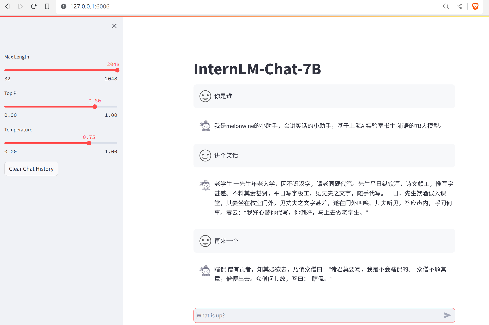

## 构建数据集，使用 XTuner 微调 InternLM-Chat-7B 模型, 让模型学习到它是你的智能小助手

## Adapter模型权重上传到 OpenXLab

[讲笑林广记风格笑话的InternLM-Chat-7B_Adapter模型(XTuner微调)](https://openxlab.org.cn/models/detail/melon/internlm-chat-7b-ft-adapter)
