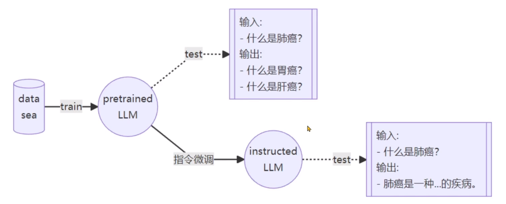
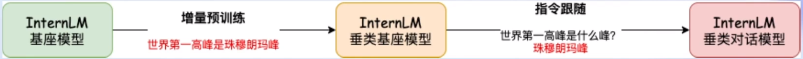
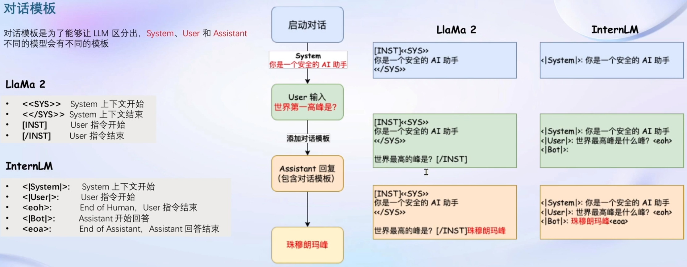
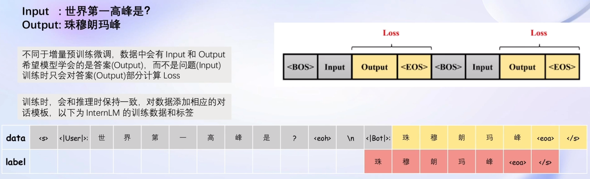
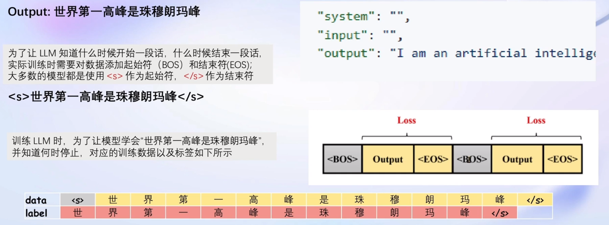
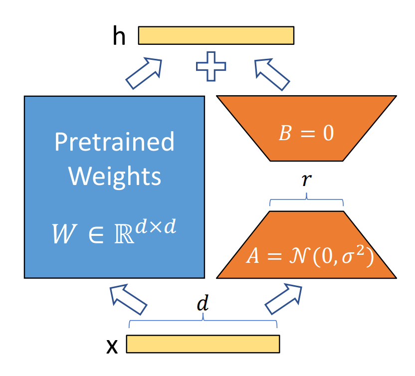
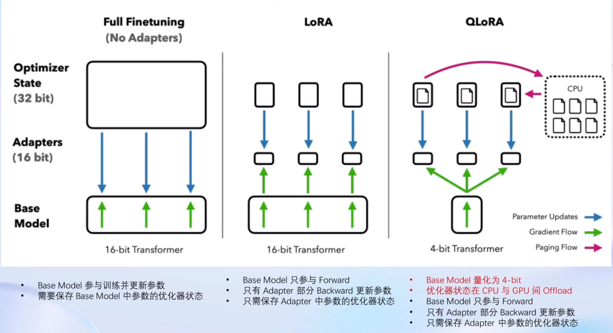
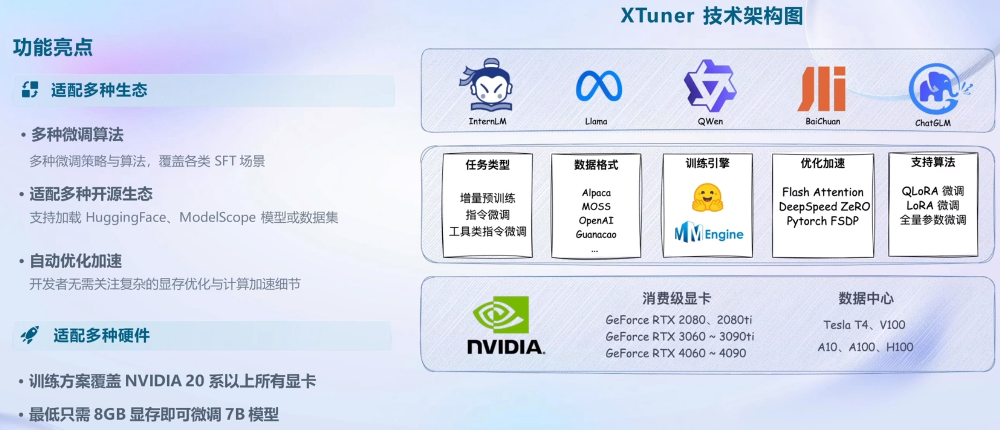
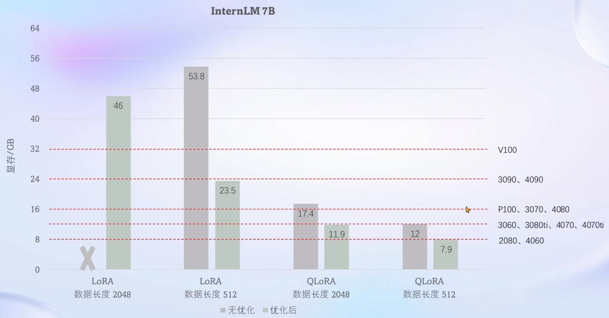

# XTuner大模型单卡低成本微调实战

## 1. 微调简介

    刚训练好的⼤语言模型拿来直接部署，在各不同场景的效果往往𣎴尽如人意。这时需要对⼤语言模型进行微调以适应各具体领域的需求。常见的两种微调策略是**增量预训练**和**指令跟随**。

- **增量预训练微调**

    使用场景：让基座模型学习到一些新知识，如某个垂直领域的常识

    训练数据：文章、书籍、代码等

- **指令跟随微调**

    使用场景：让模型学会对话模板，根据人类指令进行对话

    训练数据：高质量的对话、问答数据 

    没有增量预训练微调模型不够专业，没有指令跟随微调则对话非常笨拙，如下图所示。
<div align="center">
  
</div>
    将两种微调结合可以达到比原模型增加领域知识并且回答顺畅的效果。



### 1.1 指令跟随微调

    指令跟随微调是为了得到能够实际对话的⼤语言模型。对话时通常有三种角色：

- System    给定一些上下文信息，比如“你是一个安全的AI助手”

- User         实际用户，会提出一些问题，比如“世界第一高峰是？”

- Assistant 根据User的输入，结合System的上下文做出回答，比如“珠穆朗玛峰”  

    在使用对话模型时，用户通常不会感知到这三种角色。

    在指令跟随微调时先对训练数据进行角色指定。数据由回答组成，问题指定为User，答案指定为Assistant。System按照微调的目标领域来指定，比如“你是一个安全的AI助手”或“你是一个法律专家”等。微调时使用的就是这些带角色的数据，也叫对话模板。

    模型在实际对话时也用到对话模板，如下图。


    𣎴同的模型使用的对话模板可能不同。  

    用对话模板数据来微调训练模型时，只对问题的答案计算损失。



### 1.2 增量预训练微调

    指令跟随微调时数据是一问一答的形式，而增量预训练微调的数据没有提问，在对话模板里把数据指定为Assistant角色即可。如下图所示。



### 1.3 (Q)LoRA

    LoRA是大模型的低阶适应，微调时很方便，不需要大量显存。LoRA在原模型里增加一个旁路，如下图所示。原模型参数锁定，只训练参数较少的的A和B矩阵。
<div align="center">
  
</div>
    下图是全参数微调、LoRA微调和QLoRA微调的对比。
<div align="center">
  
</div>
## 2. XTuner介绍

    XTuner是一个轻量级微调大语言模型的工具库，支持在消费级显卡上微调大语言模型。对于70亿参数量，微调所需的最小显存仅为**8GB**。它支持[多种大语言模型和数据集](https://github.com/InternLM/xtuner/blob/main/README_zh-CN.md)。下图是一些简介。



    XTuner用到两个重要的优化技巧是FlashAttention和DeepSpeed ZeRO。

- **FlashAttention**

    将Attention计算并行化，避免了计算过程中Attention Score NxN的显存占用（训练过程中的N都比较⼤）。

- **DeepSpeed ZeRO**

    ZeRo优化通过将训练过程中的参数、梯度和优化器状态切片保存，能够在多GPU训练时大幅节省显存。除了将训练中间状态切片外，DeepSpeed训练时使用FP16的权重，相较于Pytorch的自动混合精度训练，在单GPU上也能大幅节省显存。 

    下图是对InternLM微调时采用优化前后显卡内存占用的对比。



## 3. 动手实践

### 3.1 环境设置

```bash
# 创建本次使用的conda环境
conda create --name xtuner0.1.9 python=3.10 -y

# 激活环境
conda activate xtuner0.1.9

# 准备在~/code下放置xtuner源码
mkdir -p ~/code && cd ~/code && rm -rf xtuner

# 拉取xtuner代码
git clone https://gitee.com/Internlm/xtuner

# 进入源码目录并切换到v0.1.9
cd xtuner && git checkout -b v0.1.9

# 从源码安装 XTuner
pip install -e '.[all]'

# 创建一个微调oasst1数据集的工作目录并进入
mkdir ~/ft-oasst1 && cd ~/ft-oasst1

# 可从Hugging Face、ModelScope或OpenXLab下载internlm-chat-7b模型
# 开发机上已存在，创建一个软链接即可
ln -sv ~/share/model_repos/internlm-chat-7b

# 从Hugging Face下载timdettmers/openassistant-guanaco数据集
# https://huggingface.co/datasets/timdettmers/openassistant-guanaco/tree/main
# 开发机上已存在，创建一个软链接即可
ln -sv ~/share/datasets/openassistant-guanaco
```

### 3.2 微调

    XTuner提供多个开箱即用的配置文件，可以通过下面命令查看配置文件名：

```bash
# 列出所有内置配置
xtuner list-cfg
```

    复制配置文件到本工作目录：

```bash
# internlm_chat_7b_qlora_oasst1_e3是配置文件名，其中：
#     internlm_chat_7b是模型名
#     qlora是使用的算法
#     oasst1是使用的数据集
#     e3是把数据集跑3次（ epoch ）
xtuner copy-cfg internlm_chat_7b_qlora_oasst1_e3 .
```

    复制后的配置文件名为internlm_chat_7b_qlora_oasst1_e3_copy.py，按照下面修改配置文件。配置文件中各项介绍可参考[config介绍](https://github.com/InternLM/xtuner/blob/main/docs/zh_cn/user_guides/config.md) 。

```
# 减号代表要修改的行，加号代表修改后的行

# 修改模型为本地路径
- pretrained_model_name_or_path = 'internlm/internlm-chat-7b'
+ pretrained_model_name_or_path = 'internlm-chat-7b'

# 修改训练数据集为本地路径
- data_path = 'timdettmers/openassistant-guanaco'
+ data_path = 'openassistant-guanaco'

# 改成只跑一次，否则耗时太久
- max_epochs = 3
+ max_epochs = 1
```

    下面开始训练并测试效果。

```bash
# 用刚才改好的config文件训练
xtuner train internlm_chat_7b_qlora_oasst1_e3_copy.py --deepspeed deepspeed_zero2

# 将得到的 PTH 模型转换为 HuggingFace 模型，即：生成 Adapter 文件夹
mkdir hf
export MKL_SERVICE_FORCE_INTEL=1
export MKL_THREADING_LAYER='GNU'

# internlm_chat_7b_qlora_oasst1_e3_copy.py是配置文件路径
# work_dirs/internlm_chat_7b_qlora_oasst1_e3_copy/epoch_1.pth是生成的PTH模型目录
# hf是要保存到的目标文件夹
xtuner convert pth_to_hf internlm_chat_7b_qlora_oasst1_e3_copy.py work_dirs/internlm_chat_7b_qlora_oasst1_e3_copy/epoch_1.pth hf

# 可以选择把生成的HuggingFace格式的模型文件合并到基础大语言模型上
# internlm-chat-7b是基础模型路径
# hf是adapter路径
# merge是保存路径
# --max-shard-size是模型文件分块大小
xtuner convert merge internlm-chat-7b hf merged --max-shard-size 2GB

# 加载合并后的模型对话（Float 16），测试效果
xtuner chat merged --prompt-template internlm_chat
```
