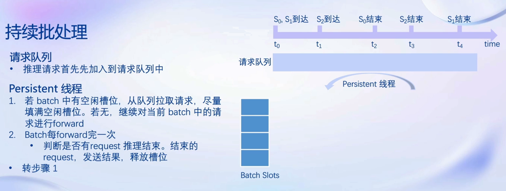

# 用LMDeploy量化和部署大模型

## 1. 大模型部署背景


## 2. LMDeploy简介

    LMDeploy是LLM在NVIDIA设备上部署的全流程解决方案，包括模型轻量化、推理引擎和Web服务。


### 2.1 量化


### 2.2 推理引擎TurboMind





<div align="center">
<table>
  <tr>
    <td><div align="center"></div></td>
    <td><div align="center"></div></td>
  </tr>
  <tr>
    <td><div align="center"></div></td>
    <td><div align="center"></div></td>
  </tr>
</table>
</div>


### 2.3 推理服务


## 3. 实践

### 3.1 环境配置

```bash
# SSH连接到实验机，执行bash进入conda后
# 从本地克隆一个已有的 pytorch 2.0.1 的环境
conda create -n lmdeploy --clone /share/conda_envs/internlm-base

# 激活环境
conda activate lmdeploy

# 解决运行lmdeploy时碰到 ModuleNotFoundError: No module named 'packaging' 的问题
pip install packaging

# 安装已准备好的flash_attn包
pip install /share/wheels/flash_attn-2.4.2+cu118torch2.0cxx11abiTRUE-cp310-cp310-linux_x86_64.whl

# 安装所有依赖
pip install 'lmdeploy[all]==v0.1.0'
```

### 3.2 服务部署

#### 3.2.1 模型转换

    使用 TurboMind 推理模型需要先将模型转化为 TurboMind 的格式，目前支持在线转换和离线转换两种形式。在线转换可以直接加载 Huggingface 模型，离线转换需要先下载模型再加载。这里使用lmdeploy convert离线转换。   

```bash
# interlm-chat-7b是模型名，支持的模型名可通过lmdeploy list查看
# model/ailab/internlm-chat-7b是模型文件目录
# --dst_path=ilm_chat7b_tm是指定转换后要保存到的目录
lmdeploy convert internlm-chat-7b model/ailab/internlm-chat-7b/ --dst_path=ilm_chat7b_tm
```

#### 3.2.2 模型配置

    文件ilm_chat7b_tm/triton_models/weights/config.ini是模型相关的配置信息，如下所示。

```ini
[llama]
model_name = internlm-chat-7b
tensor_para_size = 1
head_num = 32
kv_head_num = 32
vocab_size = 103168
num_layer = 32
inter_size = 11008
norm_eps = 1e-06
attn_bias = 1
start_id = 1
end_id = 2
session_len = 2056
weight_type = fp16
rotary_embedding = 128
rope_theta = 10000.0
size_per_head = 128
group_size = 0
max_batch_size = 64
max_context_token_num = 1
step_length = 1
cache_max_entry_count = 0.5
cache_block_seq_len = 128
cache_chunk_size = 1
use_context_fmha = 1
quant_policy = 0
max_position_embeddings = 2048
rope_scaling_factor = 0.0
use_logn_attn = 0
```

    其中可更改的参数如下：

```ini
tensor_para_size = 1
session_len = 2056
max_batch_size = 64
max_context_token_num = 1
step_length = 1
cache_max_entry_count = 0.5
cache_block_seq_len = 128
cache_chunk_size = 1
use_context_fmha = 1
quant_policy = 0
max_position_embeddings = 2048
rope_scaling_factor = 0.0
use_logn_attn = 0
```

    一般情况下不需要修改这些参数，但有时需要调整其中一部分配置。下面介绍三种可能需要调整的参数。

- KV int8 开关：
  - 对应参数为quant_policy，默认值为 0，表示不使用 KV Cache，如果需要开启，则将该参数设置为 4。
  - KV Cache 是对序列生成过程中的 K 和 V 进行量化，用以节省显存。后面会介绍具体的量化过程。
  - 当显存不足，或序列比较长时，建议打开此开关。
- 外推能力开关：
  - 对应参数为rope_scaling_factor，默认值为 0.0，表示不具备外推能力，设置为 1.0，可以开启 RoPE 的 Dynamic NTK 功能，支持长文本推理。另外，use_logn_attn参数表示 Attention 缩放，默认值为 0，如果要开启，可以将其改为 1。
  - 外推能力是指推理时上下文的长度超过训练时的最大长度时模型生成的能力。如果没有外推能力，当推理时上下文长度超过训练时的最大长度，效果会急剧下降。相反，则下降不那么明显，当然如果超出太多，效果也会下降的厉害。
  - 当推理文本非常长（明显超过了训练时的最大长度）时，建议开启外推能力。
- 批处理大小：
  - 对应参数为max_batch_size，默认为 64，也就是我们在 API Server 启动时的instance_num参数。
  - 该参数值越大，吞度量越大（同时接受的请求数），但也会占用更多显存。
  - 建议根据请求量和最大的上下文长度，按实际情况调整。

#### 3.2.3 TurboMind推理+命令行本地对话

    模型转换完成后，可以先测试直接通过命令和TurboMind对话，看推理的效果。

```bash
# Turbomind + Local CmdLine Chat
# ilm_chat7b_tm 是转换后的TurboMind格式的模型
lmdeploy chat turbomind ilm_chat7b_tm
# exit回车两次退出
```

#### 3.2.4 TurboMind推理+API服务

```bash
# ApiServer+Turbomind   api_server => AsyncEngine => TurboMind
# ilm_chat7b_tm是转换后的TurboMind格式的模型
# --server_name和--server_port分别是绑定的服务地址和端口
# --instance_num，表示实例数，可以理解成 Batch 的大小
# --tp是模型在张量并行时，使用的显卡数量，必须是2的整数次幂
lmdeploy serve api_server ilm_chat7b_tm \
    --server_name 0.0.0.0 \
    --server_port 23333 \
    --instance_num 64 \
    --tp 1
```

    可以在实验机上新开一个Shell（进入lmdeploy conda环境），直接测试API服务。

```bash
# ChatApiClient+ApiServer（注意是http协议，需要加http）
lmdeploy serve api_client http://localhost:23333
# 开始聊天，结束后退出
```

    也可在本地测试，按下面设置好端口映射后在本地打开[http://localhost:23333](http://localhost:23333) ，可以看到Swagger UI界面（如下图所示）。此界面上可以操作发送请求和API服务交互。

```bash
# 在本地终端用下面命令配置SSH端口转发
# 33090要根据开发机的SSH端口进行更改
ssh -CNg -L 23333:127.0.0.1:23333 root@ssh.intern-ai.org.cn -p 33090
```


#### 3.2.5 简单网页演示

    将Gradio作为前端演示。

##### 3.2.5.1 TurboMind服务作为后端

    这种方式先通过lmdeploy serve api_server启动服务，然后启动作为前端的Gradio。

```bash
# Gradio+ApiServer。必须先开启 Server，此时 Gradio 为 Client
lmdeploy serve gradio http://0.0.0.0:23333 \
    --server_name 0.0.0.0 \
    --server_port 6006 \
    --restful_api True
```

    把6006端口映射后即可在本地打开[localhost:6006](localhost:6006) 测试聊天。

##### 3.2.5.2 TurboMind推理直接作为后端

    Gradio也可以直接和TurboMind连接，此时没有启动API Server。如下所示。

```bash
# Gradio+Turbomind(local)
lmdeploy serve gradio ilm_chat7b_tm
```

    从3.2.3到3.2.5中提到的各种部署方法在实际应用中可按需选择使用。

### 3.3 模型量化

    量化的主要目的是降低显存占用，主要包括两方面的显存：中间过程计算结果和模型参数。KV Cache量化可减少计算量和显存使用，AWQ量化可大幅减少显存占用和模型本身的硬盘占用。除此之外量化一般还能带来性能的提升，因为更小精度的浮点数要比高精度的浮点数计算效率高，而整型要比浮点数高很多。

#### 3.3.1 KV Cache量化

    KV Cache量化是将已经生成序列的K和V变成int8类型，使用过程一共包括三步。

    **第一步：计算minmax**

    通过计算给定输入样本在每一层不同位置处计算结果的统计情况。

- 对于 Attention 的 K 和 V：取每个 Head 各自维度在所有Token的最大、最小和绝对值最大值。对每一层来说，上面三组值都是 (num_heads, head_dim) 的矩阵。这里的统计结果将用于本小节的 KV Cache。

- 对于模型每层的输入：取对应维度的最大、最小、均值、绝对值最大和绝对值均值。每一层每个位置的输入都有对应的统计值，它们大多是 (hidden_dim, ) 的一维向量，当然在 FFN 层由于结构是先变宽后恢复，因此恢复的位置维度并不相同。这里的统计结果用于下个小节的模型参数量化。

```bash
# 计算 minmax
# --model 模型文件
# --calib_dataset 选择的数据集名称，会从Hugging Face上下载该数据集
# --calib_samples 选择多少条输入样本，每条样本长度为 2048，
# --calib_seqlen 每条样本的长度
# --work_dir 输出目录
# 如果显存不足，可以适当调小 samples 的数量或 sample 的长度
lmdeploy lite calibrate \
  --model ~/model/ailab/internlm-chat-7b/ \
  --calib_dataset "c4" \
  --calib_samples 128 \
  --calib_seqlen 2048 \
  --work_dir quant_output
```

    **第二步：通过minmax获取量化参数**

    主要就是利用下面这个公式，获取每一层的 K V 中心值（zp）和缩放值（scale）。有这两个值就可以进行量化和解量化操作了。对历史的 K 和 V 存储 quant 后的值，使用时再 dequant。

```
zp = (min+max) / 2
scale = (max-min) / 255
quant: q = round( (f-zp) / scale)
dequant: f = q * scale + zp
```

```bash
# 通过 minmax 获取量化参数
# --work_dir 上面的输出目录
# --turbomind_dir TurboMind格式的模型，每一层的中心值和缩放值会存储到 该目录下的参数目录中以便后续使用
# --kv_sym
#      True  使用对称量化方法，使用第一步存储的绝对值最大值
#      False 使用非对称量化方法，使用第一步存储的最大值和最小值
# --num_tp 张量并行数
lmdeploy lite kv_qparams \
  --work_dir quant_output  \
  --turbomind_dir ilm_chat7b_tm/triton_models/weights/ \
  --kv_sym False \
  --num_tp 1
```

    **第三步：修改配置**

    修改ilm_chat7b_tm/triton_models/weights/config.ini文件，quant_policy改为4即可。

    至此就可简单评估KV Cache量化的效果了。启动gradio聊天并观察显存使用情况。

```bash
lmdeploy serve gradio ilm_chat7b_tm
```

#### 3.3.2 AWQ量化

    AWQ是激活感知权重量化，这里采用W4A16。A是指Activation，保持FP16，只对参数进行4bit量化。也是三步。

    **第一步：同3.3.1 KV Cache量化的第一步相同**

    **第二步：量化权重模型**

    利用第一步得到的统计值对参数进行量化。命令如下：

```bash
# 量化权重模型
# --model 模型文件
# --w_bits 量化的位数
# --w_group_size 量化分组统计的尺寸
# --work_dir 量化后模型输出的位置
lmdeploy lite auto_awq \
  --model ~/model/ailab/internlm-chat-7b/ \
  --w_bits 4 \
  --w_group_size 128 \
  --work_dir quant_w4a16_output
```

    **第三步：转换成TurboMind格式**

```bash
# 转换模型的layout
# internlm-chat-7b 是模型名
# quant_w4a16_output 是W4A16量化保存目录
# --model-format 模型格式，指定为awq
# --group-size 上一步中的w_group_size
# --dst_path TurboMind格式模型保存路径
lmdeploy convert internlm-chat-7b quant_w4a16_output \
    --model-format awq \
    --group-size 128 \
    --dst_path ilm_chat7b_w4a16_tm
```

    至此就可以评估量化后的效果了。AWQ可显著减少显存使用。

#### 3.3.3 量化建议

    在各种配置下尝试，看效果能否满足需要。一般需要在自己的数据集上进行测试。具体步骤如下：

1. 优先尝试正常（非量化）版本，评估效果
    - 如果效果不行，需要尝试更大参数模型或者微调
    - 如果效果可以，跳到下一步
2. 尝试正常版本+KV Cache 量化，评估效果
    - 如果效果不行，回到上一步
    - 如果效果可以，跳到下一步
3. 尝试量化版本，评估效果
    - 如果效果不行，回到上一步
    - 如果效果可以，跳到下一步
4. 尝试量化版本+ KV Cache 量化，评估效果
    - 如果效果不行，回到上一步
    - 如果效果可以，使用方案

    另外，使用哪种量化版本、开启哪些功能，除了上述流程外，**还需要考虑框架、显卡的支持情况**，比如有些框架可能不支持 W4A16 的推理。

    一般情况下：
    精度越高，显存占用越多，推理效率越低，但一般效果较好。
    服务端推理一般用非量化版本或半精度、BF16、Int8 等精度的量化版本，比较少使用更低精度的量化版本。
    客户端推理一般都使用量化版本，且大多是低精度的量化版本。主要是受计算资源限制。
