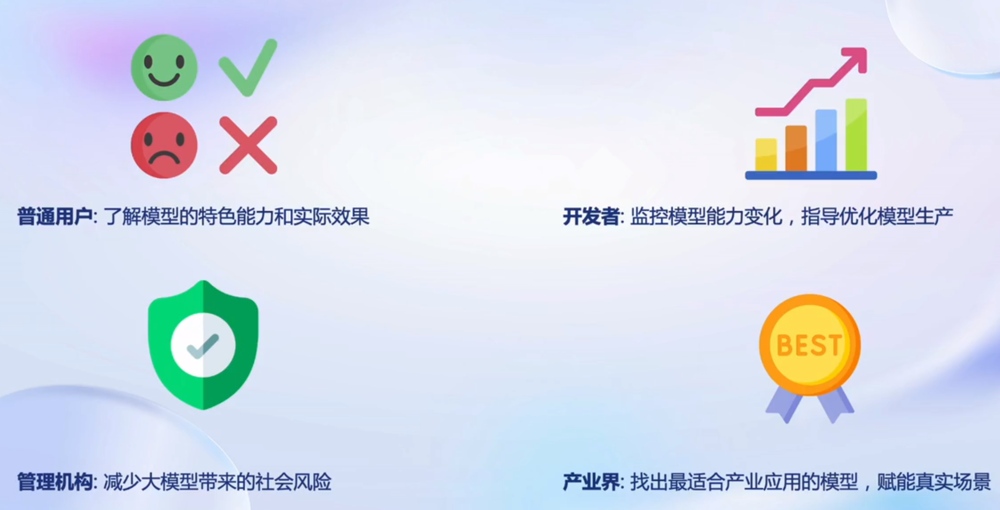
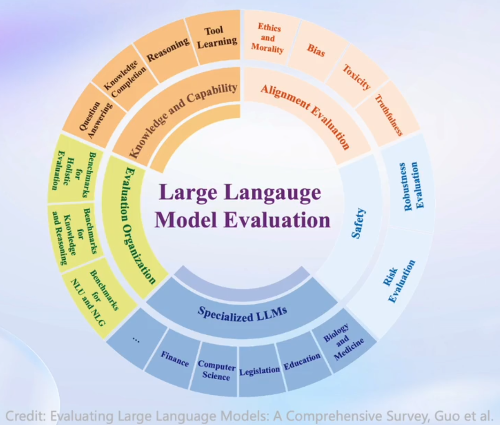
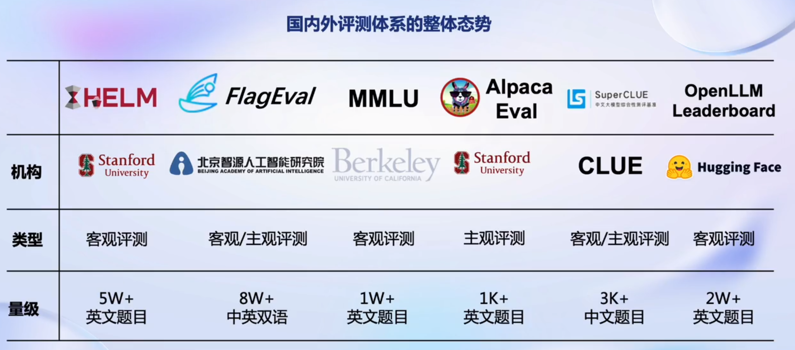
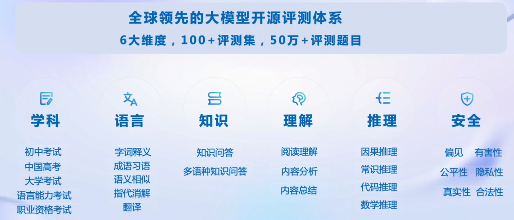
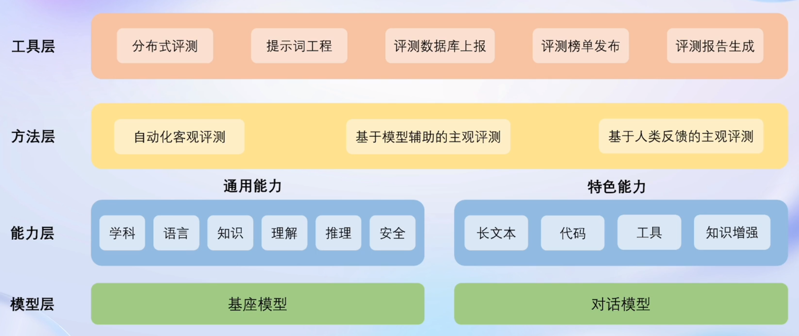
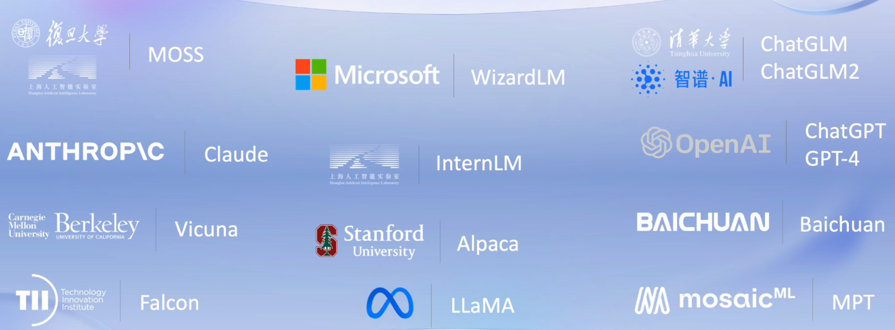
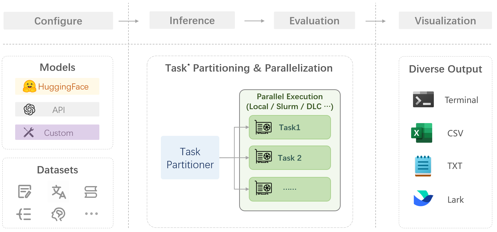
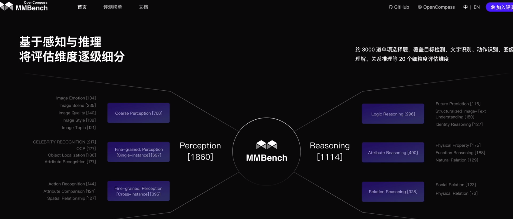
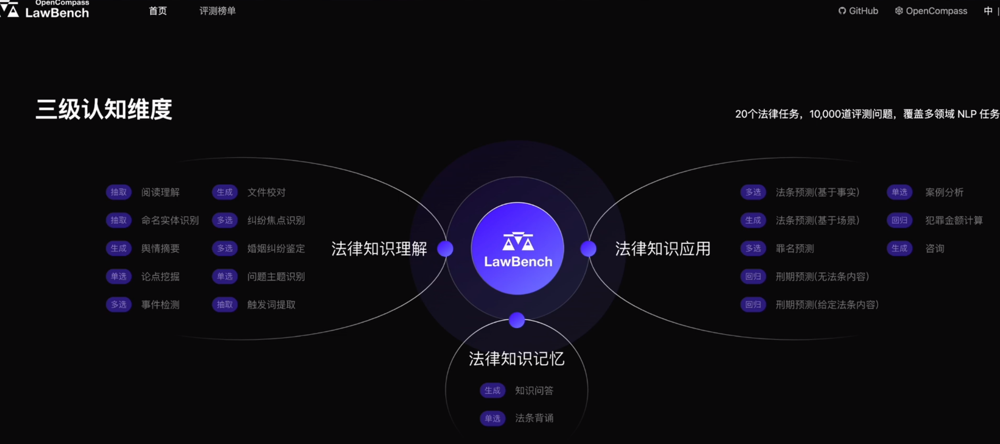
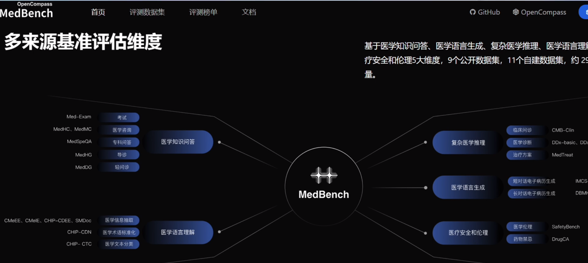

# OpenCompass大模型评测

## 1. 大模型评测介绍

### 1.1 为什么要评测



### 1.2 需要评测什么

<div align="center"></div>

### 1.3 怎样评测⼤模型

#### 1.3.1 客观评测

    针对具有标准答案的客观问题，通过使用定量指标比较模型的输出与标准答案的差异，并根据结果衡量模型的性能。同时，由于大语言模型输出自由度较高，在评测阶段，需要对其输入和输出作一定的规范和设计，尽可能减少噪声输出在评测阶段的影响，才能对模型的能力有更加完整和客观的评价。

    在客观评测的具体实践中，通常采用下列两种方式进行模型输出结果的评测：

**判别式评测：** 将问题与候选答案组合在一起，计算模型在所有组合上的困惑度（perplexity），并选择困惑度最小的答案作为模型的最终输出。例如，若模型在 问题? 答案1 上的困惑度为 0.1，在 问题? 答案2 上的困惑度为 0.2，最终我们会选择 答案1 作为模型的输出。

**生成式评测：** 主要用于生成类任务，如语言翻译、程序生成、逻辑分析题等。使用问题作为模型的原始输入，并留白答案区域待模型进行后续补全。通常还需要对其输出进行后处理，以保证输出满足数据集的要求。

#### 1.3.2 主观评测

    针对如模型安全和模型语言能力的评测，以人的主观感受为主的评测更能体现模型的真实能力，并更符合大模型的实际使用场景。

    提前基于模型的能力维度构建主观测试问题集合，将不同模型对于同一问题的不同回复展现给受试者，收集受试者基于主观感受的评分。纯人工的主观评测成本高昂，一般也使用性能优异的大语言模型模拟人类进行主观打分。

### 1.4 主流大模型评测框架



## 2. OpenCompass介绍



### 2.1 工具架构

### 2.2 模型支持丰富



### 2.3 评测流水线

    OpenCompass评估一个模型通常包括以下几个阶段：配置 -> 推理 -> 评估 -> 可视化。

**配置：** 整个工作流的起点，配置整个评估过程，选择要评估的模型和数据集。此外，还可以选择评估策略、计算后端等，并定义显示结果的方式。

**推理与评估：** OpenCompass对模型和数据集进行并行推理和评估。推理阶段主要是让模型从数据集产生输出，评估阶段则是衡量这些输出与标准答案的匹配程度。这两个过程会被拆分为多个同时运行的“任务”以提高效率，但如果计算资源有限，这种策略可能会使评测变得更慢。

**可视化：** 评估完成后，OpenCompass将结果整理成易读的表格，并将其保存为CSV和TXT文件。也可以激活飞书状态上报功能，此后可以在飞书客户端中及时获得评测状态报告。



### 2.4 前沿探索

**多模态**

**法律领域**

**医疗领域**


### 2.5 ⼤模型评测的挑战

<div align="center"></div>

## 3. 评测实践

    使用OpenCompass评测InternLM2-Chat-7B模型在 [C-Eval](https://cevalbenchmark.com/) 数据集上的性能。

### 3.1 环境准备

```bash
# SSH连接到实验机，运行bash，然后执行下面的命令
conda create --name opencompass --clone=/root/share/conda_envs/internlm-base
conda activate opencompass
git clone https://hub.fgit.cf/open-compass/opencompass
cd opencompass
pip install -e .

# 解压评测数据集，将会在opencompass下看到data文件夹
unzip /share/temp/datasets/OpenCompassData-core-20231110.zip

# 查看支持的数据集和模型
# 列出所有跟internlm及ceval相关的配置
python tools/list_configs.py internlm ceval
```

### 3.2 启动评测

    执行下面命令开始评测：

```bash
# --datasets 在什么数据集上评测
# --hf-path 模型路径
# --tokenizer-path 分词器路径
# --tokenizer-kwargs 分词器参数
# --model-kwargs 模型参数
# --max-seq-len 模型可以接受的最大序列长度
# --max-out-len 生成的最大token数
# --batch-size 批量大小
# --num-gpus GPU数量
# --debug 在终端看到更多信息
python run.py --datasets ceval_gen \
              --hf-path /share/model_repos/internlm2-chat-7b/ \
              --tokenizer-path /share/model_repos/internlm2-chat-7b/ \
              --tokenizer-kwargs padding_side='left' truncation='left' trust_remote_code=True \
              --model-kwargs trust_remote_code=True device_map='auto' \
              --max-seq-len 2048 \
              --max-out-len 16 \
              --batch-size 4 \
              --num-gpus 1 \
              --debug
```

    评测完成后在终端可以看到评测结果，在outputs/default下也可看到结果，目录结构如下：

```
outputs/
`-- default
    `-- 20240126_155730 # 每个实验一个文件夹
        |-- configs     # 用于记录的已转储的配置文件。如果在同一个实验文件夹中重新运行了不同的实验，可能会保留多个配置
        |   `-- 20240126_155730.py
        |-- logs        # 推理和评估阶段的日志文件，如果命令行使用了--debug则不会输出到此文件夹
        |-- predictions # 每个任务的推理结果
        |   `-- opencompass.models.huggingface.HuggingFace_model_repos_internlm2-chat-7b
        |-- results     # 每个任务的评估结果
        |   `-- opencompass.models.huggingface.HuggingFace_model_repos_internlm2-chat-7b
        `-- summary     # 单个实验的汇总评估结果
            |-- summary_20240126_155730.csv
            `-- summary_20240126_155730.txt
```

OpenCompass更详细的使用方法见 [OpenCompass文档](https://opencompass.org.cn/doc) 。


